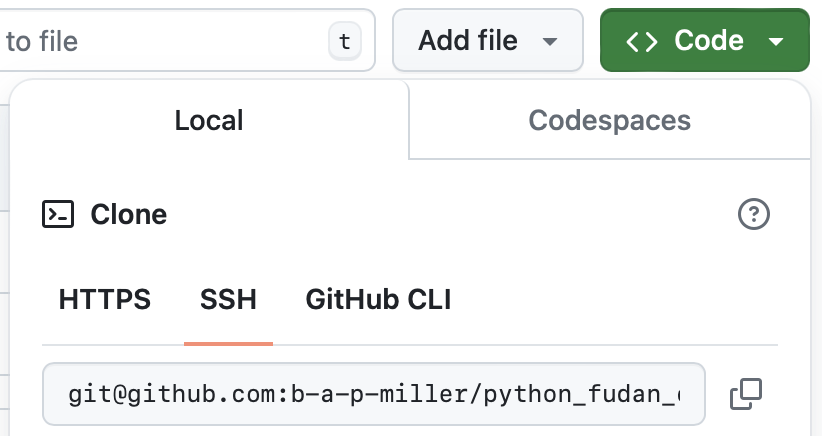

# Creating a GitHub Account and Setting Up SSH Authentication

## Signing Up for GitHub

- If you don't have a GitHub account, sign up at [GitHub Education](https://github.com/edu).
- Login to your account.
- After logging in, click on the "Create Repository" button at the top left.

## Creating Your Exercises Repository
- **Repository name:** `python_fudan_exercises`
- **Description:** (leave blank for now)
- **Choose visibility:** Private
- **Initialize this repository with:**
  - A README file (check this option)
- **Add .gitignore:** search for and select Python
- **Choose a license:** None
- Click "Create repository"

## What is SSH?
- SSH keys provide a secure way to authenticate with GitHub.
- This tutorial will guide you through setting up SSH keys to clone the repository.

## Step 1: Check for Existing SSH Keys
- Open your Terminal (Mac/Linux) or Git Bash (Windows).
- Enter the command: `ls -al ~/.ssh`
- If you see an error message like `ls: cannot access '/home/user/.ssh': No such file or directory`, you do not have SSH keys.
- If files named `id_rsa` and `id_rsa.pub` exist, you already have SSH keys. If you know the password, skip the next step; otherwise, create a new key.

## Step 2: Generate a New SSH Key
- If you don't have an SSH key called `id_rsa`, generate a new one:
  ```bash
  ssh-keygen -t rsa -b 4096 -C "email@example.com"
  ```
  Change "email@example.com" to the email you used to sign up for GitHub.
- When prompted, press Enter to save the key in the default location.
- Enter a secure passphrase when prompted.

## Step 3: Add SSH Key to SSH-Agent
- Start the SSH agent:
  ```bash
  eval "$(ssh-agent -s)"
  ```
  You should see output similar to: `Agent pid 12345`
- Add your SSH key to the agent:
  ```bash
  ssh-add ~/.ssh/id_rsa
  ```

## Step 4: Add SSH Key to GitHub Account
- Copy the SSH key to your clipboard:
  - **Mac:** `pbcopy < ~/.ssh/id_rsa.pub`
  - **Windows/Linux:** Use `cat ~/.ssh/id_rsa.pub` and manually copy the output.
- Go to GitHub and navigate to Settings. Click on "SSH and GPG keys" in the sidebar.
- Click "New SSH key".
- Under "Title", type a name that refers to your computer.
- Paste your key under "Key".
- Click "Add SSH key".

## Step 5: Test SSH Connection
- Test the connection:
  ```bash
  ssh -T git@github.com
  ```
- You may see a warning message asking to confirm the authenticity of the host. Type "yes" to continue.
- You should see a message like: `Hi username! You've successfully authenticated, but GitHub does not provide shell access.`

## Step 6: Clone the Repository

- Navigate to the repository on GitHub.
- Click the "Code" button and select the SSH tab.
- Copy the SSH URL.
- In your terminal, run:
  ```bash
  git clone git@github.com:yourusername/python_fudan_exercises.git
  ```
  The repository will be cloned to your local machine.

### Step 7: Configure Git

Before you start working with Git, it's crucial to configure your Git identity. This identity is used in every commit you make, and it's important for collaboration so that your teammates can see who made each change.

1. **Set Your Username**
   Open your terminal and set your global username using Git:
   ```bash
   git config --global user.name "Your Name"
   ```
   Replace `"Your Name"` with your actual name. This is the name that will appear in the commit messages.

2. **Set Your Email Address**
   Set your global email address with Git:
   ```bash
   git config --global user.email "you@example.com"
   ```
   Replace `"you@example.com"` with the email address associated with your GitHub account. This should be the same email you use for logging into GitHub.

3. **Verify Your Configuration**
   To check that your Git configuration is set up correctly, run:
   ```bash
   git config --list
   ```
   This command will list all settings Git has configured, including your username and email.
```
