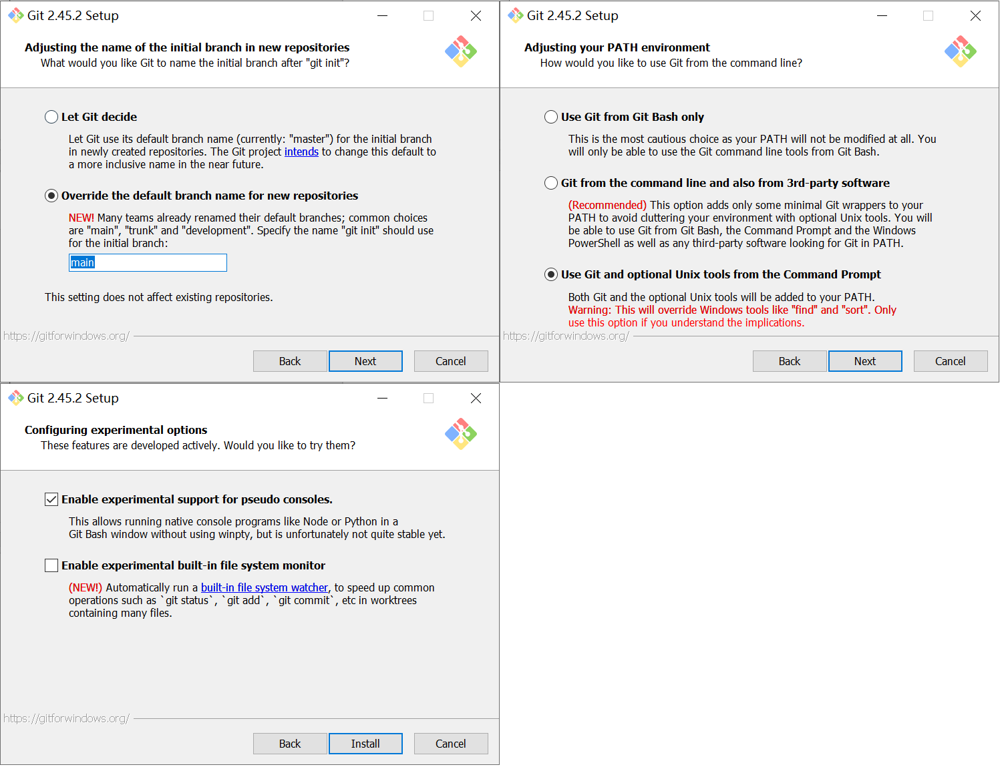

# How to Copy and Paste in Git Bash

This guide explains how to enable and use copy and paste functionality in Git Bash using shortcut keys.

## Enabling Copy and Paste

1. **Open Git Bash Options**:
   - Click the Git Bash icon in the top left corner of the window.
   - Choose "Options" from the dropdown menu.

   

2. **Modify Keyboard Options**:
   - In the Options menu, navigate to the "Keys" tab.
   - Check the option "Copy and Paste (Ctrl+Shift+Ins)" to enable it.

   

3. **Save and Apply Changes**:
   - Click "Apply" and then "Save" to apply the changes.

## Copying and Pasting

- **To Copy**: Select the text you want to copy in Git Bash, and then use `Ctrl+Shift+Ins` to copy.
- **To Paste**: Click where you want to paste the text and press `Ctrl+Shift+Ins`.

This method allows you to efficiently copy and paste text using Git Bash, facilitating better workflow and data transfer between the terminal and other applications.
